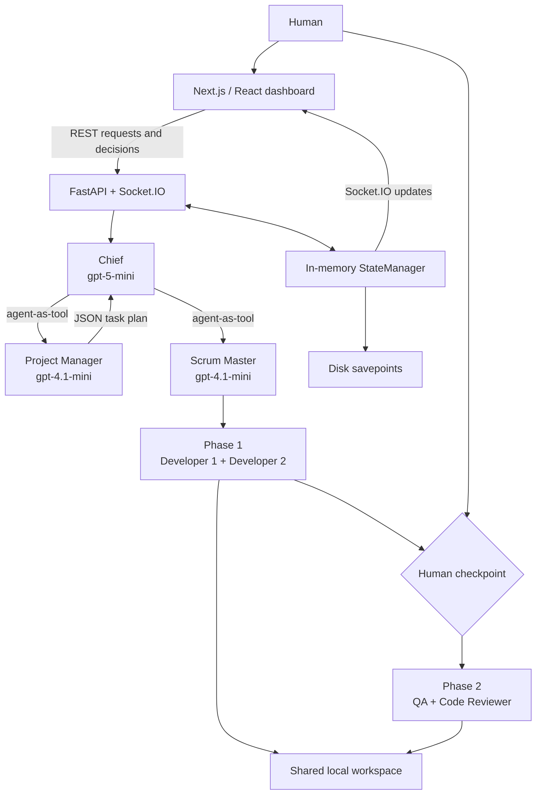
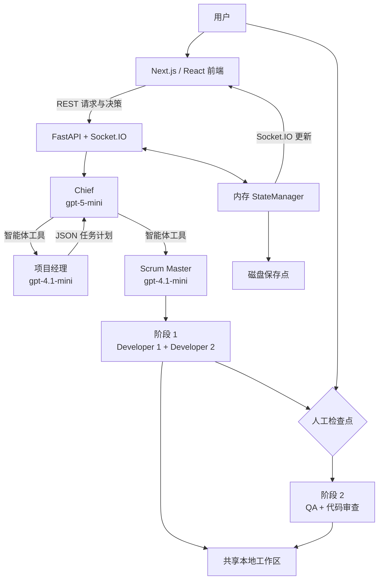

# DLWK — AI-Governed Dev Team

[English](#english) · [简体中文](#简体中文)

> **Prototype status:** DLWK is a local research/demo project, not a production-ready autonomous development platform. It can write real files and run real shell commands. Use only a disposable workspace and do not expose the unauthenticated backend to untrusted networks.

## English

### Overview

DLWK is a human-governed, multi-agent software engineering prototype. A user describes what they want to build, a Chief agent coordinates planning through a Project Manager and Scrum Master, and specialised Developer, QA and Code Reviewer agents work against a shared local workspace.

The dashboard visualises the team as a pixel office and Scrum board. It streams agent activity, presents task checkpoints, shows file diffs and lets a human approve, reject, pause or redirect work.

### What is implemented

- Seven runtime agent instances across six roles.
- OpenAI Agents SDK integration through the `openai-agents` Python package.
- FastAPI backend with 17 explicit REST operations.
- Socket.IO event layer with 24 server-to-client and 10 client-to-server application events.
- Next.js 16, React 19 and TypeScript dashboard.
- Four-column Kanban board and Canvas 2D pixel office.
- Chief → PM → Scrum Master delegation.
- Parallel Dev1/Dev2 phase followed by parallel QA/Code Reviewer phase.
- Real workspace file editing, shell commands and test execution.
- Human task checkpoints, per-file diff review and savepoint/revert support.

### Workflow

1. The user sends a request to the Chief and selects a workspace.
2. The Chief clarifies the request and presents a plan.
3. After approval, the Chief asks the PM for a JSON task breakdown.
4. The Scrum Master publishes and assigns the tasks.
5. Developer 1 and Developer 2 execute assigned work concurrently.
6. Human checkpoints separate development from review and testing.
7. QA and Code Reviewer inspect the shared workspace concurrently.
8. The dashboard streams progress and accepts checkpoint or file-review decisions.

The PM/SM steps are model-driven. Once started, worker grouping and phase order are deterministic.

### Architecture



### Agents

| Agent | Model | Primary responsibility |
|---|---|---|
| Chief | `gpt-5-mini` | Clarification, planning, delegation and escalation; no file or shell tools |
| Project Manager | `gpt-4.1-mini` | Produce a JSON-text task breakdown |
| Scrum Master | `gpt-4.1-mini` | Publish tasks, assign agents and start execution |
| Developer 1 | `gpt-5-mini` | Full-stack implementation |
| Developer 2 | `gpt-5-mini` | Backend-oriented implementation |
| QA Engineer | `gpt-5-mini` | Write and run tests |
| Code Reviewer | `gpt-5-mini` | Review correctness, security, performance and maintainability |

### Technology

| Layer | Technology |
|---|---|
| Agent runtime | OpenAI Agents SDK (`openai-agents`) |
| Backend | Python, FastAPI, Uvicorn, Pydantic v2, python-socketio |
| Frontend | Next.js 16, React 19, TypeScript, Tailwind CSS v4 |
| Real-time transport | Socket.IO with WebSocket and polling support |
| Visualisation | Canvas 2D and MetroCity sprite sheets |
| State | In-memory application state plus filesystem savepoints |

The repository uses the OpenAI Agents SDK, not Codex CLI and not direct model HTTP calls.

### Getting started

#### Prerequisites

- Python 3.12 recommended; Python 3.10 or newer is required by the source syntax.
- Node.js and npm compatible with Next.js 16.
- An OpenAI API key with access to the configured models.
- A disposable local directory for generated work.

#### Backend

```bash
cd backend
python3.12 -m venv venv
source venv/bin/activate
python -m pip install -r requirements.txt

OPENAI_API_KEY='REPLACE_WITH_YOUR_KEY' \
WORKSPACE_ROOT='/absolute/path/to/disposable-workspace' \
python main.py
```

The backend starts on `http://localhost:8000`.

#### Frontend

In another terminal:

```bash
cd frontend
npm ci
NEXT_PUBLIC_BACKEND_URL='http://localhost:8000' npm run dev
```

Open `http://localhost:3000`.

### Cost and safety

- Agent chat and workflow execution call paid OpenAI models.
- Worker agents can execute arbitrary shell commands; the workspace path is not an OS sandbox.
- File review is **post-write**: a file is changed first, then shown for acceptance or rollback.
- APIs and Socket.IO handlers have no authentication.
- Runtime tasks, chat, activity and agent memory are lost when the backend restarts.
- Workspace files persist. Savepoint folders persist on disk, but are not automatically reloaded after restart.
- Do not use production code, credentials or sensitive data in a demonstration workspace.

### Current limitations

- No automated unit, integration or end-to-end test suite.
- No CI workflow, durable database, token accounting or cost limit.
- No isolated branches/worktrees or conflict detection for concurrent agents.
- Task dependencies and definitions of done are stored but not enforced.
- Some governance steps rely on model instructions or UI behavior rather than hard backend gates.
- No saved quantitative evaluation or single-agent versus multi-agent comparison.
- No deployment or incident-response implementation.

### Repository layout

```text
backend/             FastAPI, Socket.IO, state and agent orchestration
frontend/            Next.js dashboard and pixel-office interface
openclaw-skills/     Optional integration documentation/scaffolding
project_spec.md      Product intent and feature specification
architecture_design.md
                     Detailed architecture notes
analysis.md          Evidence-backed repository and portfolio report
```

### Evidence and project status

The available Git history spans 1–8 March 2026 and contains multiple author identities. That history shows repository activity, not necessarily the full project duration or sole authorship.

For verified claims, implementation gaps, test conditions and disclosure notes, see [analysis.md](analysis.md). No repository-level licence is currently included.

---

## 简体中文

### 项目概述

DLWK 是一个由人工监督的多智能体软件工程原型。用户描述需要构建的软件后，Chief 智能体会通过项目经理和 Scrum Master 完成规划与分工，再由开发、QA 和代码审查智能体在同一个本地工作区中执行任务。

前端以像素办公室和 Scrum 看板展示团队状态，并实时显示智能体活动、任务检查点和文件差异。用户可以批准、拒绝、暂停或重新分配工作。

### 已实现功能

- 六种角色、七个运行时智能体实例。
- 通过 Python `openai-agents` 包集成 OpenAI Agents SDK。
- FastAPI 后端，共 17 个明确声明的 REST 操作。
- Socket.IO 事件层：24 个服务端到客户端事件、10 个客户端到服务端事件。
- 使用 Next.js 16、React 19 和 TypeScript 的前端。
- 四列 Kanban 看板和 Canvas 2D 像素办公室。
- Chief → 项目经理 → Scrum Master 的委派流程。
- Dev1/Dev2 并行开发阶段，以及后续 QA/代码审查并行阶段。
- 真实的工作区文件编辑、Shell 命令和测试执行。
- 人工任务检查点、逐文件差异审查和保存点回退。

### 工作流程

1. 用户向 Chief 提交需求并指定工作区。
2. Chief 澄清需求并展示计划。
3. 用户批准后，Chief 请求项目经理生成 JSON 任务分解。
4. Scrum Master 发布任务并分配智能体。
5. Developer 1 和 Developer 2 并行执行开发任务。
6. 人工检查点将开发阶段与审查/测试阶段分隔。
7. QA 和代码审查智能体并行检查共享工作区。
8. 前端实时展示进度，并接收检查点或文件审查决定。

项目经理和 Scrum Master 的工具选择由模型决定；工作阶段启动后，智能体分组和阶段顺序由代码确定。

### 架构



### 智能体角色

| 智能体 | 模型 | 主要职责 |
|---|---|---|
| Chief | `gpt-5-mini` | 澄清、规划、委派和升级处理；没有文件或 Shell 工具 |
| 项目经理 | `gpt-4.1-mini` | 生成 JSON 文本格式的任务分解 |
| Scrum Master | `gpt-4.1-mini` | 发布任务、分配智能体并启动执行 |
| Developer 1 | `gpt-5-mini` | 全栈实现 |
| Developer 2 | `gpt-5-mini` | 偏后端实现 |
| QA 工程师 | `gpt-5-mini` | 编写并运行测试 |
| 代码审查员 | `gpt-5-mini` | 审查正确性、安全性、性能和可维护性 |

### 技术栈

| 层级 | 技术 |
|---|---|
| 智能体运行时 | OpenAI Agents SDK（`openai-agents`） |
| 后端 | Python、FastAPI、Uvicorn、Pydantic v2、python-socketio |
| 前端 | Next.js 16、React 19、TypeScript、Tailwind CSS v4 |
| 实时通信 | Socket.IO，支持 WebSocket 和轮询 |
| 可视化 | Canvas 2D 和 MetroCity 精灵图 |
| 状态 | 内存应用状态和文件系统保存点 |

本项目使用 OpenAI Agents SDK，而不是 Codex CLI，也没有直接发送模型 HTTP 请求。

### 本地运行

#### 前置条件

- 推荐 Python 3.12；源代码语法至少需要 Python 3.10。
- 与 Next.js 16 兼容的 Node.js 和 npm。
- 能访问所配置模型的 OpenAI API 密钥。
- 一个用于生成文件的临时本地目录。

#### 后端

```bash
cd backend
python3.12 -m venv venv
source venv/bin/activate
python -m pip install -r requirements.txt

OPENAI_API_KEY='REPLACE_WITH_YOUR_KEY' \
WORKSPACE_ROOT='/absolute/path/to/disposable-workspace' \
python main.py
```

后端运行于 `http://localhost:8000`。

#### 前端

在另一个终端中运行：

```bash
cd frontend
npm ci
NEXT_PUBLIC_BACKEND_URL='http://localhost:8000' npm run dev
```

浏览器打开 `http://localhost:3000`。

### 成本与安全说明

- 智能体聊天和工作流会调用可能产生费用的 OpenAI 模型。
- 工作智能体可以执行任意 Shell 命令；工作区路径并不等同于操作系统沙箱。
- 文件审查属于**写入后审查**：文件会先被修改，再由用户接受或回退。
- REST API 和 Socket.IO 处理器没有身份认证。
- 后端重启后，运行时任务、聊天、活动记录和智能体内存会丢失。
- 工作区文件会保留。保存点目录也会保留在磁盘上，但重启后不会自动加载。
- 演示时不要使用生产代码、凭据或敏感数据。

### 当前限制

- 没有自动化单元测试、集成测试或端到端测试。
- 没有 CI、持久化数据库、Token 统计或成本限制。
- 并行智能体没有独立分支、worktree 或冲突检测。
- 任务依赖和完成标准可以保存，但不会被执行器强制检查。
- 部分治理步骤依赖模型提示词或前端行为，而不是后端强制关卡。
- 没有保存的量化评估，也没有单智能体与多智能体的对照实验。
- 没有部署或事故响应实现。

### 仓库结构

```text
backend/             FastAPI、Socket.IO、状态和智能体编排
frontend/            Next.js 看板和像素办公室界面
openclaw-skills/     可选集成文档与脚手架
project_spec.md      产品目标与功能规格
architecture_design.md
                     详细架构说明
analysis.md          基于证据的仓库与作品集分析报告
```

### 证据与项目状态

当前 Git 历史记录覆盖 2026 年 3 月 1 日至 8 日，并包含多个作者身份。该记录只能证明这段时间内存在仓库活动，不能单独证明完整项目周期或个人独立作者身份。

有关已验证的功能、缺失项、测试条件和披露注意事项，请参阅 [analysis.md](analysis.md)。仓库目前没有根目录许可证文件。
