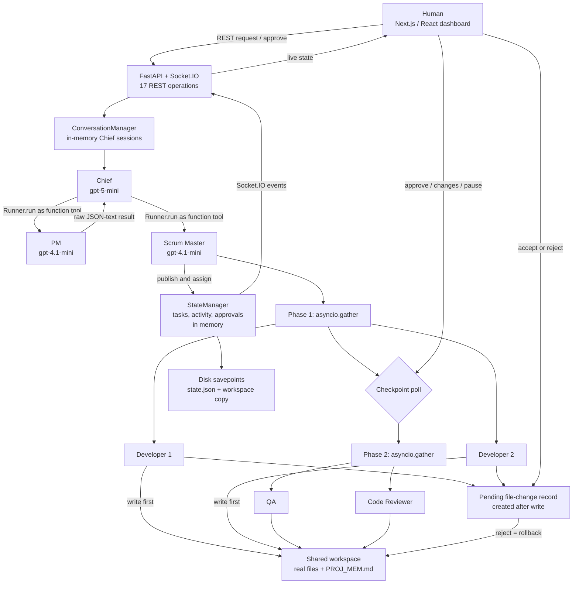

# DLWK repository evidence report

Scope: local inspection of clean checkout at Git HEAD `2bddea0`. I inspected source, configuration, documentation, dependencies, tests, workflows and Git history. I did not modify the repository, start services, invoke models, use credentials, access production or install dependencies.

Classification:

- **Verified from code** — directly supported by current executable code, configuration or Git metadata.
- **Documented but not independently verified** — asserted by project documents or commit messages, without a reproducible run.
- **Inferred—requires confirmation** — reasonable interpretation requiring your confirmation.
- **Missing** — no supporting implementation or artifact found.

## Résumé-claim verdicts

| Earlier claim | Verdict |
|---|---|
| Chief delegates to PM, Scrum Master, Developer, QA and Reviewer agents | **Verified from code, with correction.** The Chief directly invokes only PM and Scrum Master as function tools. The Scrum Master assigns Dev1, Dev2, QA and Code Reviewer and starts the worker pipeline. |
| FastAPI backend with 17 REST endpoints and 20+ WebSocket events | **Verified from code, with terminology correction.** Exactly 17 explicit REST method/path operations; 24 unique server-emitted and 10 client-input Socket.IO application events. Socket.IO may use WebSocket or HTTP polling. |
| Next.js/React interface with Scrum workflow visualisation | **Verified from code.** Next.js 16.1.6, React 19.2.3, TypeScript, a Canvas 2D office and a four-column Kanban board. |
| Human review through a code-diff interface | **Verified from code, but partial as a control.** The interface displays diffs and sends accept/reject decisions, but agents write to disk before approval. Rejection rolls the change back. |
| OpenAI Codex Agents SDK, FastAPI, Next.js, Socket.IO, React and TypeScript | **Partially verified.** The installed Python dependency is `openai-agents`, imported as `agents`: this is the OpenAI Agents SDK, not Codex CLI and not a separately identified “Codex Agents SDK”. The remaining technologies are verified. |
| Project dates: March 2026 | **Verified only as a Git activity window.** The available history spans 1–8 March 2026; it does not establish the full project or internship period. |

# 1. PROJECT BASICS

### Name and purpose

- **Documented but not independently verified:** The main specification calls the project **“AI-Governed Dev Team with Human Oversight”** and describes a human-governed AI software engineering team for enterprise software teams across the SDLC ([project_spec.md:1](/Users/jesmondtay/Documents/DLWk/project_spec.md:1), [project_spec.md:5](/Users/jesmondtay/Documents/DLWk/project_spec.md:5)).
- **Verified from code:** The backend identifies itself as “AI Dev Team Backend” ([backend/main.py:178](/Users/jesmondtay/Documents/DLWk/backend/main.py:178)).
- **Verified from code:** The current UI is branded `scrumAgents.` rather than DLWK or AI-Governed Dev Team ([Header.tsx:75](/Users/jesmondtay/Documents/DLWk/frontend/src/components/Header.tsx:75)).
- **Inferred—requires confirmation:** A defensible external title is **“DLWK — AI-Governed Dev Team”**, but you should confirm which of the three names is official.

The problem addressed is coordination and oversight of AI coding work: converting a natural-language software request into planned tasks, allocating those tasks to specialised model agents, executing work in a shared workspace, and exposing progress and approval points to a human.

The documented target is an enterprise software team. The current unauthenticated, process-local implementation is better characterised as a **single-machine research or demonstration prototype**, not an enterprise-ready service.

### Inputs and outputs

**Verified from code:**

Users provide:

- A natural-language request through the Chief’s command bar or chat.
- An absolute workspace path.
- Follow-up answers and plan approval.
- Checkpoint approval, change requests or pause decisions.
- Per-file accept/reject decisions and feedback.
- Optional direct messages to individual agents.
- Manual task moves and agent pause/reassign/cancel actions.

The system can produce:

- A PM-generated JSON-text task proposal and Kanban tasks.
- Agent assignments, status changes and activity events.
- Real files written into the selected workspace.
- Test files and subprocess test output when the generated command is runnable.
- In-memory code artifacts and pending-file-change records.
- Human checkpoints and review feedback loops.
- Disk savepoint directories containing state JSON and a workspace copy.
- A streamed Chief response.

It does **not** implement a pull request, branch, deployment or packaged-deliverable output.

### Completion status

| Area | Status | Evidence and limitation |
|---|---|---|
| Agent definitions and SDK execution | **Verified from code — implemented** | Seven instances and six role types; model calls use `Runner` ([definitions.py:66](/Users/jesmondtay/Documents/DLWk/backend/ai_agents/definitions.py:66), [runner.py:112](/Users/jesmondtay/Documents/DLWk/backend/ai_agents/runner.py:112)). Not runtime-tested in this inspection. |
| Planning and delegation | **Verified from code — implemented/partial** | Chief→PM→SM tool chain exists, but the ordering and plan stop are primarily prompt-driven rather than server-enforced. |
| Worker execution | **Verified from code — implemented/partial** | Dev1/Dev2 run concurrently, followed by QA/Reviewer concurrently ([tools.py:1088](/Users/jesmondtay/Documents/DLWk/backend/ai_agents/tools.py:1088)). Dependency ordering is absent. |
| Files and shell commands | **Verified from code — implemented** | Real workspace I/O and subprocess execution exist ([tools.py:258](/Users/jesmondtay/Documents/DLWk/backend/ai_agents/tools.py:258), [tools.py:359](/Users/jesmondtay/Documents/DLWk/backend/ai_agents/tools.py:359)). There is no OS-level sandbox. |
| Dashboard | **Verified from code — implemented/partial** | Pixel office, Kanban, approvals, activity graph and metrics UI are present ([page.tsx:173](/Users/jesmondtay/Documents/DLWk/frontend/src/app/page.tsx:173)). Sprint information is partly hard-coded. |
| Human checkpoints | **Verified from code — partial** | Real backend checkpoint transitions exist, but missing checkpoints, manual task moves, the idle monitor and synthetic UI checkpoints can bypass the intended gate. |
| File review | **Verified from code — partial** | Diff accept/reject is functional, but review occurs after disk mutation. |
| Persistence | **Verified from code — partial** | Workspace and snapshot files persist; runtime state, conversations and agent memory do not automatically survive restart. |
| Mock/demo behavior | **Verified from code — limited** | Offline mock agents are used if the backend fetch fails ([useAgents.ts:36](/Users/jesmondtay/Documents/DLWk/frontend/src/hooks/useAgents.ts:36)). Other mock task data is present but not wired into the page. |
| Full SDLC, deployment and incident response | **Documented but not independently verified / partial** | Promised by the specification, but deployment and incident-response workflows are absent. |
| OpenClaw integration | **Documented but not independently verified / partial scaffolding** | Local skill documents exist, but they require manual installation and reference two absent SDLC API routes ([openclaw-skills/README.md:28](/Users/jesmondtay/Documents/DLWk/openclaw-skills/README.md:28), [openclaw-skills/README.md:61](/Users/jesmondtay/Documents/DLWk/openclaw-skills/README.md:61)). |
| Production readiness | **Missing** | No authentication, database, hard sandbox, automated suite, CI, quantitative evaluation or multi-tenant isolation. |

### Timeline and team evidence

- **Verified from code/Git metadata:** 32 commits are available, dated from **1 March 2026 to 8 March 2026**.
- **Missing:** No release tags, milestone record or evidence establishing the actual project start/end dates.
- **Verified from Git metadata:** The history contains three distinct human author identities: `Samrath-dev` (21 commits), `harish950` (6) and `Jesmond Tay Soon Xiang` (5).
- **Inferred—requires confirmation:** These identities suggest at least three contributors, but they do not prove the actual team size, roles or whether identities map one-to-one to people.
- **Verified from Git metadata:** Four commits have Claude co-author trailers; three of those are attributed to the Jesmond Git identity.
- **Missing:** No contributor agreement, CODEOWNERS file or authorship statement supports sole repository ownership.

# 2. MY CONTRIBUTION

This section assumes—but does not establish—that the Git identity `Jesmond Tay Soon Xiang` is yours.

### Git-supported contribution record

| Commit | Git-attributed work | Current relevance | Caveat |
|---|---|---|---|
| `6ccf0c6`, “SDLC and PM” | 13 files, +2,061/−139; introduced SDLC fields, a store and several frontend SDLC views | Task SDLC fields remain in current models ([models.py:76](/Users/jesmondtay/Documents/DLWk/backend/models.py:76)) | The dedicated `sdlc_store.py`, progress bar and phase panels are no longer in HEAD. Do not present all of this commit as current functionality. |
| `5b9ad70`, pipeline/approval overhaul | Checkpoint-gated two-phase execution, auto-resume, queue-listener fixes and task status simplification | Current `run_phases`, `resume_pipeline`, and precise approval-hook cleanup reflect this work ([tools.py:942](/Users/jesmondtay/Documents/DLWk/backend/ai_agents/tools.py:942), [runner.py:320](/Users/jesmondtay/Documents/DLWk/backend/ai_agents/runner.py:320), [useCheckpoints.ts:13](/Users/jesmondtay/Documents/DLWk/frontend/src/hooks/useCheckpoints.ts:13)) | Commit has a Claude Sonnet 4.6 co-author trailer. |
| `4fb1d27`, command-bar stacking fix | One-line z-index correction | Current command bar wrapper has `z-10` ([PixelOfficeBanner.tsx:817](/Users/jesmondtay/Documents/DLWk/frontend/src/components/PixelOfficeBanner.tsx:817)) | Claude Sonnet 4.6 co-author trailer; no automated UI regression test. |
| `0f7ceb6`, loading screen | Added the Chief planning/loading presentation and `current_activity` field | Loading/chalkboard transition remains in the page ([page.tsx:190](/Users/jesmondtay/Documents/DLWk/frontend/src/app/page.tsx:190)) | Claude Sonnet 4.6 co-author trailer. |
| `c2c915e`, “added new things” | Idle recovery, task association and frontend behavior changes | Current idle monitor and related task handling remain ([main.py:58](/Users/jesmondtay/Documents/DLWk/backend/main.py:58)) | Commit message does not clearly document rationale or ownership of each change. |

### Defensible contribution statement

**Inferred—requires confirmation:**

> I contributed to the task lifecycle and orchestration layer, including phase sequencing, human checkpoint handling, stalled-work recovery, approval-queue state consistency, SDLC task metadata and planning/loading UX. The repository was multi-author, and some of my commits record AI co-authorship.

That statement is more supportable than claiming that you independently built the whole platform.

### What still needs your confirmation

- Which Git identity is yours and whether all five commits reflect work you personally directed.
- Which changes were independently implemented, pair-programmed, AI-assisted, reviewed, or merely committed/merged by you.
- Whether you designed the pipeline or implemented an existing team design.
- Whether the removed SDLC subsystem should be discussed as an experiment, a rejected design, or superseded work.
- The team’s roles and division of backend, frontend, agent prompting, testing and documentation.
- Whether you are authorised to display teammates’ code in a university portfolio.

### Major technical decisions to explain in an interview

1. Why role-specialised agents were chosen instead of a single coding agent.
2. Why the Chief directly invokes PM and Scrum Master as function tools rather than using SDK handoffs.
3. Why execution became deterministic two-phase scheduling after the documented Scrum Master stall.
4. Why QA and Code Reviewer run together rather than strictly QA-before-review.
5. Why state is centralised in memory and broadcast with Socket.IO.
6. Why all workers share one workspace, and what would be required for safe concurrent editing.
7. Why file review is rollback-after-write rather than approve-before-apply.
8. Which controls are genuine code restrictions and which depend on model prompt compliance.
9. How AI-assisted commits were reviewed and validated by you.

# 3. MULTI-AGENT ARCHITECTURE

## Actual frameworks and integration

**Verified from code:**

- Backend: FastAPI, Uvicorn, Pydantic v2 and `python-socketio` ([requirements.txt:1](/Users/jesmondtay/Documents/DLWk/backend/requirements.txt:1)).
- Agent layer: `openai-agents>=0.10.0`; `Agent`, `Runner`, `function_tool` and `RunContextWrapper` are imported from `agents` ([requirements.txt:5](/Users/jesmondtay/Documents/DLWk/backend/requirements.txt:5), [definitions.py:16](/Users/jesmondtay/Documents/DLWk/backend/ai_agents/definitions.py:16)).
- Frontend: Next.js 16.1.6, React 19.2.3, Socket.IO client, TypeScript and Tailwind ([package.json:5](/Users/jesmondtay/Documents/DLWk/frontend/package.json:5)).
- Pixel visualisation: native Canvas 2D, not Phaser ([PixelOfficeBanner.tsx:175](/Users/jesmondtay/Documents/DLWk/frontend/src/components/PixelOfficeBanner.tsx:175)).

**Correction:** The executable integration is the **OpenAI Agents SDK**. No Codex CLI invocation was found. No code constructs a direct `OpenAI`/`AsyncOpenAI` client or calls model HTTP endpoints directly; model execution is delegated to `Runner`. The documents’ “Codex Agents SDK” wording is therefore inaccurate or informal.

Models configured in code:

- `gpt-5-mini`: Chief, both Developers, QA and Code Reviewer.
- `gpt-4.1-mini`: PM and Scrum Master.

No rationale for this split is documented.

## Agents and roles

There are **six role types but seven runtime agent instances**, because Developer is instantiated twice ([models.py:22](/Users/jesmondtay/Documents/DLWk/backend/models.py:22), [state.py:95](/Users/jesmondtay/Documents/DLWk/backend/state.py:95)).

| Agent | Responsibilities and inputs | Outputs and tools | State and handoff |
|---|---|---|---|
| Chief / `agent-boss` | Receives user request and Chief session history; asks for workspace, presents plan and coordinates | Plan/chat events, escalations, task/sprint queries, memory tools, `delegate_to_pm`, `delegate_to_scrum_master`; no file or shell tools ([definitions.py:505](/Users/jesmondtay/Documents/DLWk/backend/ai_agents/definitions.py:505)) | Chief conversation history is in `ConversationManager`; handoff is model-selected after the approval prompt. The backend does not technically prevent early delegation. |
| PM / `agent-pm` | Receives full feature description; reads project memory and directory | Intended output is a raw JSON array of 3–6 tasks; activity and memory tools ([definitions.py:390](/Users/jesmondtay/Documents/DLWk/backend/ai_agents/definitions.py:390)) | Output returns to Chief as a function result. It is not schema-constrained SDK output and can be malformed. |
| Scrum Master / `agent-sm` | Receives the PM response | Parses/publishes task JSON, assigns agents, logs workload and invokes `run_agents_parallel` ([definitions.py:314](/Users/jesmondtay/Documents/DLWk/backend/ai_agents/definitions.py:314)) | Assignment category and whether tools are called correctly are model-driven; execution after `run_phases` starts is deterministic. |
| Developer 1 / `agent-dev` | Receives all backlog tasks assigned to Dev1 and shared project context | Reads/searches/edits/writes files; arbitrary shell command; artifacts, pending file changes, memory, activity and completion checkpoint ([definitions.py:66](/Users/jesmondtay/Documents/DLWk/backend/ai_agents/definitions.py:66)) | Separate `TeamContext`, but shared `StateManager` and workspace. Calls `report_task_completion` to create a human checkpoint. |
| Developer 2 / `agent-dev2` | Same mechanism, with a backend/failure-mode persona | Same execution tools as Developer 1 ([definitions.py:118](/Users/jesmondtay/Documents/DLWk/backend/ai_agents/definitions.py:118)) | Runs concurrently with Developer 1. There are no branches, edit locks or file ownership controls. |
| QA / `agent-qa` | Receives explicitly assigned testing tasks; inspects shared files | Writes a test file, runs a shell test command, logs results and creates a completion checkpoint ([definitions.py:174](/Users/jesmondtay/Documents/DLWk/backend/ai_agents/definitions.py:174), [tools.py:416](/Users/jesmondtay/Documents/DLWk/backend/ai_agents/tools.py:416)) | Runs in phase 2 alongside Reviewer. “Coverage” in its prompt is an approximate model estimate, not measured coverage ([definitions.py:209](/Users/jesmondtay/Documents/DLWk/backend/ai_agents/definitions.py:209)). |
| Code Reviewer / `agent-cr` | Receives explicitly assigned review tasks; inspects artifacts/workspace | Reads/searches code, can run shell commands, records an approval boolean and review feedback, then reports completion ([definitions.py:227](/Users/jesmondtay/Documents/DLWk/backend/ai_agents/definitions.py:227), [tools.py:550](/Users/jesmondtay/Documents/DLWk/backend/ai_agents/tools.py:550)) | Review severity rules are instructions, not backend logic. `review_code` records the model’s decision but does not itself block or advance a task. |

The common role boundary is a prompt telling out-of-scope agents to route work to the Chief ([definitions.py:54](/Users/jesmondtay/Documents/DLWk/backend/ai_agents/definitions.py:54)). Tool lists provide some hard capability separation, but role compliance within those tools remains model-dependent. For example, QA has `write_code` and arbitrary `run_command`.

## Delegation model

**Verified from code — combination of model-driven and deterministic behavior:**

- Model-driven:
  - Chief decides when to use its planning/delegation tools.
  - PM generates untyped JSON text.
  - Scrum Master chooses task assignments and invokes the scheduler.
  - Workers select tools, commands and file content.
- Deterministic:
  - `publish_task_plan` creates records from parsed JSON.
  - `run_phases` groups tasks by assignee.
  - Dev1/Dev2 run concurrently with `asyncio.gather`.
  - A checkpoint poll separates development from review/testing.
  - QA/Reviewer then run concurrently.
  - The idle monitor uses fixed keyword assignment and timing heuristics.

The Chief’s PM/SM delegation functions call `Runner.run(...)` and return the sub-agent’s output to the Chief; these are **nested agents-as-tools, not Agents SDK handoffs** ([definitions.py:454](/Users/jesmondtay/Documents/DLWk/backend/ai_agents/definitions.py:454)).

## Execution, context and memory

- **Sequential:** Chief clarify → plan → approval-triggered execution → PM → SM → development phase → review/testing phase.
- **Parallel:** Dev1 and Dev2 within phase 1; QA and Code Reviewer within phase 2 ([tools.py:1075](/Users/jesmondtay/Documents/DLWk/backend/ai_agents/tools.py:1075)).
- **Shared state:** Every worker receives a separate `TeamContext` object pointing to the same in-memory `StateManager` and workspace ([tools.py:38](/Users/jesmondtay/Documents/DLWk/backend/ai_agents/tools.py:38)).
- **Agent memory:** Up to 50 text entries per agent, held in RAM; despite its docstring saying “persistent,” it is lost on restart ([tools.py:709](/Users/jesmondtay/Documents/DLWk/backend/ai_agents/tools.py:709)).
- **Project memory:** `PROJ_MEM.md` in the selected workspace survives while the file remains ([tools.py:1413](/Users/jesmondtay/Documents/DLWk/backend/ai_agents/tools.py:1413)).
- **Conversation memory:** Chief sessions are RAM-only ([conversation.py:35](/Users/jesmondtay/Documents/DLWk/backend/conversation.py:35)).
- **Direct-agent chat:** The frontend retains per-agent messages only for the current page lifetime ([useAgentChat.ts:12](/Users/jesmondtay/Documents/DLWk/frontend/src/hooks/useAgentChat.ts:12)).

## Supported architecture diagram



## One complete task trace

1. The command bar opens the Chief interface and sends a REST `POST /api/chat/boss` request ([page.tsx:307](/Users/jesmondtay/Documents/DLWk/frontend/src/app/page.tsx:307), [main.py:305](/Users/jesmondtay/Documents/DLWk/backend/main.py:305)).
2. The backend creates or reuses an in-memory session and starts an untracked background Chief run ([main.py:315](/Users/jesmondtay/Documents/DLWk/backend/main.py:315)).
3. Chief asks for a workspace and invokes `set_workspace`, which accepts and can create any absolute directory ([tools.py:1158](/Users/jesmondtay/Documents/DLWk/backend/ai_agents/tools.py:1158)).
4. Chief calls `present_plan`; the tool emits `boss_plan` to the UI. It does not update the `ConversationManager.plan` field or technically disable delegation tools ([tools.py:809](/Users/jesmondtay/Documents/DLWk/backend/ai_agents/tools.py:809)).
5. The user’s approval calls `POST /api/chat/boss/approve-plan`. The endpoint checks only that the session exists, marks its phase approved and launches a new execution prompt ([main.py:339](/Users/jesmondtay/Documents/DLWk/backend/main.py:339)).
6. Chief invokes PM. PM returns a JSON-text task list. Chief passes that text to Scrum Master ([definitions.py:463](/Users/jesmondtay/Documents/DLWk/backend/ai_agents/definitions.py:463)).
7. Scrum Master publishes records and assigns each task. Dependencies and definitions of done are not enforced. The primary publish path also discards PM’s `estimated_size` field ([tools.py:874](/Users/jesmondtay/Documents/DLWk/backend/ai_agents/tools.py:874)).
8. Dev1 and Dev2 receive all their assigned backlog tasks and run concurrently. They share a filesystem, read/write files and may run shell commands.
9. Each file is written first, then represented as a pending change. File review and task checkpoint approval are independent; the scheduler does not wait for pending file decisions.
10. If a worker calls `report_task_completion`, a checkpoint is created. Human approval advances `in_progress → review` and creates a savepoint ([tools.py:589](/Users/jesmondtay/Documents/DLWk/backend/ai_agents/tools.py:589), [state.py:268](/Users/jesmondtay/Documents/DLWk/backend/state.py:268)).
11. After phase-1 checkpoints cease to be pending, explicit QA and Code Reviewer tasks run concurrently. There is no automatic “same task” handoff from developer artifact to QA and reviewer; task relations are implicit through the shared board and workspace.
12. The pipeline normally leaves first-pass tasks in `review`. The frontend creates synthetic checkpoints for review tasks and approving one emits a manual task move to `done`, bypassing backend checkpoint/savepoint logic ([useApprovalQueue.ts:79](/Users/jesmondtay/Documents/DLWk/frontend/src/hooks/useApprovalQueue.ts:79), [ApprovalQueue.tsx:171](/Users/jesmondtay/Documents/DLWk/frontend/src/components/ApprovalQueue.tsx:171)).
13. Generated files remain in the workspace and the Chief eventually emits its final streamed response. No PR, merge or deployment is created.

## Executable behavior versus descriptions

| Category | Findings |
|---|---|
| **Real executable behavior** | Agents SDK runners, real disk reads/writes, arbitrary local subprocesses, task/event state, Socket.IO streaming, checkpoints, rollback and snapshot copying. |
| **Prompt-defined rather than enforced** | Role discipline, exact delegation sequence, “critical bugs block advancement,” minimum activity counts, self-review quality, coverage estimates and the requirement to call completion. |
| **UI-only derivation** | Synthetic review checkpoints, “story points” calculated from priority, the activity-based “Git Graph,” and heuristic Code Dosimeter scores. |
| **Mocked/disabled** | Offline mock agent statuses; a disabled simulation module. The simulation still refers to removed `TaskStatus.TESTING` and is stale ([simulation.py:30](/Users/jesmondtay/Documents/DLWk/backend/simulation.py:30), [models.py:31](/Users/jesmondtay/Documents/DLWk/backend/models.py:31)). |
| **Documentation-only/planned** | OpenClaw installation, full SDLC gates, deployment, incident response and a hardened sandbox. |

# 4. ORCHESTRATION AND ENGINEERING CONTROLS

| Capability | Status | Evidence-backed assessment |
|---|---|---|
| Task creation and assignment | **Partial** | Structured task models and assignment functions exist ([tools.py:82](/Users/jesmondtay/Documents/DLWk/backend/ai_agents/tools.py:82), [tools.py:171](/Users/jesmondtay/Documents/DLWk/backend/ai_agents/tools.py:171)). Assignment is model-driven or keyword-based on recovery. |
| Dependencies | **Absent as a control** | `dependencies` is only a string field; the scheduler never reads it ([models.py:114](/Users/jesmondtay/Documents/DLWk/backend/models.py:114)). |
| Completion criteria | **Partial** | `definition_of_done` can be stored but is never evaluated. Progress depends on the agent voluntarily calling `report_task_completion`. If no checkpoint is created, the phase gate immediately passes ([tools.py:1006](/Users/jesmondtay/Documents/DLWk/backend/ai_agents/tools.py:1006)). |
| Agent communication | **Partial** | PM/SM outputs return as function results, while shared state/activity uses Pydantic records and Socket.IO. There is no message bus, durable mailbox or peer-to-peer protocol. |
| Structured agent output | **Partial** | PM is instructed to emit JSON, but no SDK `output_type` or schema validation is configured; `publish_task_plan` parses raw JSON and assumes each item is a mapping. |
| Sequential/parallel control | **Implemented** | Deterministic two-phase grouping and `asyncio.gather` exist. |
| Concurrent edit isolation | **Absent** | Workers share one workspace with no branches, worktrees, locks, file ownership or merge/conflict detection. |
| File path confinement | **Partial/inadequate** | File helpers attempt path containment using string-prefix comparison ([tools.py:70](/Users/jesmondtay/Documents/DLWk/backend/ai_agents/tools.py:70)). The comparison is not a robust path relationship check, and arbitrary shell commands can bypass it entirely. |
| OS/process sandbox | **Absent** | `create_subprocess_shell` runs model-provided commands in the workspace, but the process itself is not confined to that directory ([tools.py:386](/Users/jesmondtay/Documents/DLWk/backend/ai_agents/tools.py:386)). |
| Role permissions | **Partial** | Per-agent tool lists prevent Chief file/shell use. Other role rules are largely prompt-based, and several specialists retain arbitrary command capability. |
| Command/test timeout | **Implemented** | Shell and test processes have a 120-second timeout and output truncation. |
| Model timeout/retry | **Missing** | The repository sets `max_turns=100`, but defines no model wall-clock timeout, retry policy, exponential backoff or resumable run state. Dependency-internal behavior was not assessed. |
| Cancellation | **Partial/UI-only** | Pause/reassign/cancel handlers mutate board and agent state, but do not cancel an active `Runner` or subprocess ([main.py:745](/Users/jesmondtay/Documents/DLWk/backend/main.py:745)). |
| Failed-agent recovery | **Partial and unsafe** | Exceptions become result strings and the phase continues. The idle monitor can re-run unfinished work, but also promotes tasks based solely on all agents being idle ([main.py:92](/Users/jesmondtay/Documents/DLWk/backend/main.py:92)). |
| Review feedback/rework | **Partial** | Checkpoint change requests and file rejections start another agent run. There is no retry limit or rework-generation tracking. |
| Plan approval | **Partial** | A real backend endpoint launches execution, but only validates session existence. The Chief can technically call delegation tools before approval because the stop is prompt-enforced. |
| Task checkpoint gate | **Partial** | Backend approval changes task status, but REST/Socket task moves, synthetic UI approvals, idle promotion and a missing agent checkpoint bypass the gate. |
| File approval gate | **Partial; post-write** | Accept is a backend no-op because the file already exists; reject restores/deletes it ([state.py:333](/Users/jesmondtay/Documents/DLWk/backend/state.py:333)). |
| Logs/audit | **Partial** | Activity and terminal logs exist, but are in memory and not authenticated or durable. Some SDK/subprocess errors may be exposed to all connected clients. |
| Tracing | **Missing at project level** | No trace exporter/configuration or stored trace artifacts were found. The underlying SDK may have defaults, but that is not project evidence. |
| Token and cost limits | **Missing** | No token accounting, budget, cost calculation or spend cap was found. `max_turns` is not a token or cost limit. |
| Authentication/authorisation | **Missing** | Approval and mutation routes are unauthenticated. Socket.IO accepts all origins ([main.py:36](/Users/jesmondtay/Documents/DLWk/backend/main.py:36)). |

### Approval-control distinction

- The **plan approval button** invokes a backend endpoint, but the backend does not prove that a plan exists or is pending.
- A **real checkpoint approval** causes a backend state transition and savepoint.
- A **synthetic checkpoint approval** is frontend-generated and merely sends `move_task`.
- A **file accept/reject button** invokes backend logic, but it approves or rolls back a change already applied to disk.
- The header’s **“Complete Sprint”** button has no click handler ([Header.tsx:96](/Users/jesmondtay/Documents/DLWk/frontend/src/components/Header.tsx:96)).

# 5. BACKEND AND FRONTEND

## Backend architecture

A single process holds:

- FastAPI and Socket.IO ASGI applications.
- One global `StateManager`.
- One global `ConversationManager`.
- Background status and idle monitors.
- Untracked background agent tasks.

The state manager holds agents, tasks, sprint, activity, escalations, checkpoints, artifacts, file changes and savepoint descriptors in dictionaries/lists ([state.py:69](/Users/jesmondtay/Documents/DLWk/backend/state.py:69)). There is no database or repository layer.

## REST count

Counting method: count each explicit FastAPI method/path decorator once; group neither GET/POST pairs nor path parameters; exclude automatic `/docs`, `/redoc` and `/openapi.json`.

| Operations | Count |
|---|---:|
| `GET /api/agents` | 1 |
| `GET`, `POST /api/tasks`; `PATCH`, `DELETE /api/tasks/{task_id}` | 4 |
| `GET`, `POST /api/sprint` | 2 |
| `GET /api/activity`; `GET /api/escalations` | 2 |
| `POST /api/chat/boss`; `POST /api/chat/boss/approve-plan`; `POST /api/chat/{agent_id}` | 3 |
| `GET /api/checkpoints`; `POST /api/checkpoints/{checkpoint_id}/decide` | 2 |
| `GET /api/file-changes`; `POST /api/file-changes/{change_id}/decide` | 2 |
| `GET /api/savepoints` | 1 |
| **Total** | **17** |

The routes begin at [backend/main.py:204](/Users/jesmondtay/Documents/DLWk/backend/main.py:204).

## Socket.IO event count

Counting method: inspect all backend literal `emit("name", ...)` calls, deduplicate repeated names, and separately count `@sio.event` input handlers. Lifecycle `connect`/`disconnect` is excluded from application-input count.

**Server → client:** 24 unique names across 33 literal emission sites:

`activity`, `agent_chat_complete`, `agent_chat_stream`, `agent_route`, `agent_stream`, `agent_update`, `artifact`, `boss_chat_complete`, `boss_chat_stream`, `boss_plan`, `boss_plan_approved`, `boss_session`, `checkpoint_resolved`, `error`, `escalation`, `escalation_resolved`, `file_change_pending`, `file_change_resolved`, `initial_state`, `pipeline_gate`, `savepoint_created`, `savepoint_reverted`, `task_checkpoint`, `task_update`.

**Client → server:** 10 application handlers:

`boss_message`, `move_task`, `escalation_response`, `checkpoint_response`, `pause_agent`, `reassign_task`, `cancel_task`, `file_change_response`, `approve_plan_ws`, `revert_savepoint`.

The handler block begins at [backend/main.py:544](/Users/jesmondtay/Documents/DLWk/backend/main.py:544). The current frontend actually emits eight; it uses REST instead of `boss_message` and `approve_plan_ws`. It listens to 21 of the 24 server events; `artifact`, `pipeline_gate` and `error` are not consumed.

Thus the accurate portfolio phrasing is:

> “Implemented 17 explicit REST operations and a Socket.IO event layer with 24 server-to-client and 10 client-to-server application events.”

## Progress, reconnection and stale state

**Implemented:**

- REST fetches provide initial agent/task/activity/savepoint state.
- Socket events append or replace live state.
- The client permits WebSocket and polling transports and retries indefinitely with a 1–5 second reconnect delay ([socket.ts:9](/Users/jesmondtay/Documents/DLWk/frontend/src/lib/socket.ts:9)).
- On every Socket.IO connection, the backend sends `initial_state` with agents, tasks, sprint, pending approvals, savepoints and the last 20 activities ([main.py:544](/Users/jesmondtay/Documents/DLWk/backend/main.py:544)).

**Limitations:**

- Chief and direct-agent chat history is not in `initial_state`; a page reload loses the UI’s chat display.
- Activity REST can load the full log and then be overwritten by the socket’s last-20 snapshot ([useActivity.ts:11](/Users/jesmondtay/Documents/DLWk/frontend/src/hooks/useActivity.ts:11)).
- Task drag is optimistic, with no acknowledgement or rollback if the event is rejected/lost ([useTasks.ts:75](/Users/jesmondtay/Documents/DLWk/frontend/src/hooks/useTasks.ts:75)).
- Most backend events are global broadcasts. `useBossChat` does not filter stream events by `session_id`, so multiple clients/sessions could mix output ([useBossChat.ts:28](/Users/jesmondtay/Documents/DLWk/frontend/src/hooks/useBossChat.ts:28)).
- There is no event sequence number, replay log or stale-version detection.

## Scrum visualisation

**Verified from code:**

- Canvas 2D office with status-driven agent movement.
- Four Kanban columns: backlog, in progress, review and done.
- Drag-and-drop task movement ([KanbanBoard.tsx:46](/Users/jesmondtay/Documents/DLWk/frontend/src/components/KanbanBoard.tsx:46)).
- Loading/chalkboard transitions for Chief/PM activity.
- Unified checkpoint/file approval queue.
- Activity feed and an activity-derived “Git Graph.”
- Code Dosimeter.

Qualifications:

- The UI does not use the backend sprint record; it labels any nonempty board `Sprint 1` ([page.tsx:281](/Users/jesmondtay/Documents/DLWk/frontend/src/app/page.tsx:281)).
- Displayed story points are a fixed priority mapping—P0=8, P1=5, P2=3—not estimates ([TaskCard.tsx:61](/Users/jesmondtay/Documents/DLWk/frontend/src/components/TaskCard.tsx:61)).
- The Git Graph is generated from activity entries, not Git commits ([GitGraph.tsx:38](/Users/jesmondtay/Documents/DLWk/frontend/src/components/GitGraph.tsx:38)).
- “Velocity” is simply percentage of tasks marked done ([CodeDosimeter.tsx:458](/Users/jesmondtay/Documents/DLWk/frontend/src/components/CodeDosimeter.tsx:458)).
- Dosimeter scores are heuristics from fixed baselines, keyword sentiment and board counts, not static analysis or measured code quality ([CodeDosimeter.tsx:39](/Users/jesmondtay/Documents/DLWk/frontend/src/components/CodeDosimeter.tsx:39)).

## Code-diff workflow

- File creation shows every line as an addition.
- Edits use a custom set/line comparison ([ApprovalQueue.tsx:19](/Users/jesmondtay/Documents/DLWk/frontend/src/components/ApprovalQueue.tsx:19)).
- Accept and reject actions are sent to the backend ([ApprovalQueue.tsx:321](/Users/jesmondtay/Documents/DLWk/frontend/src/components/ApprovalQueue.tsx:321)).
- The custom diff is not a standard diff algorithm and can misrepresent duplicate lines or moved blocks.
- Files have already been changed before this interface appears.

## Persistence boundaries

| Data | Survives backend restart? |
|---|---|
| Generated workspace files | **Yes**, if the directory remains. |
| `PROJ_MEM.md` | **Yes**, as a workspace file. |
| Savepoint folders and `state.json` | **Physically yes**, but the new process does not scan/load them. |
| Savepoint list exposed by API | **No** after restart; it starts empty. |
| Agent/task/sprint/activity/checkpoint/artifact/file-change state | **No**. |
| Agent memory list | **No**. |
| Chief conversation sessions | **No**. |
| Browser chat/optimistic UI state | **No** after reload. |

Savepoint creation and restoration are implemented at [state.py:411](/Users/jesmondtay/Documents/DLWk/backend/state.py:411) and [state.py:440](/Users/jesmondtay/Documents/DLWk/backend/state.py:440).

# 6. TECHNICAL DECISIONS AND TRADE-OFFS

| Decision | Problem addressed and evidence | Trade-offs/limitations | Rationale status |
|---|---|---|---|
| Role-specialised agents | Separates planning, coordination, implementation, testing and review through prompts/tool lists | More model calls and handoff failure modes; role restrictions are partly prompt-only; no comparison against one agent | **Documented but not independently verified** |
| Chief with PM/SM as tools | Preserves central coordination while returning specialist outputs to Chief | Chief becomes a bottleneck; raw text must be copied between model contexts; the hierarchy is not a durable workflow engine | **Documented and verified from code** |
| Hybrid model/deterministic orchestration | Deterministic phases were introduced after reports that Scrum Master sometimes stalled | Recovery bypasses parts of governance; keyword assignment is brittle | **Documented in commit `5b9ad70`; current code verified** |
| Two phased parallel groups | Reduces wall time within development and review/testing | QA and Reviewer run simultaneously, not sequentially; shared writes can conflict; dependencies are ignored | **Verified from code; design rationale inferred** |
| Central in-memory state | Simple shared view and low prototype complexity | Lost on restart, unsuitable for multiple workers/processes, no transactions or durable audit | **Verified; rationale inferred** |
| Socket.IO event transport | Streams status and supports reconnect/fallback polling | Global broadcasts, no session isolation, ack/version/replay or durable event log | **Verified; rationale partly documented** |
| Shared real workspace | Allows agents to inspect and modify an actual project | No isolation between agents, no merge semantics and arbitrary shell escape from nominal workspace | **Verified; safety rationale in docs is overstated** |
| Post-write file review | Makes changes immediately visible and supports rollback | Human approval does not prevent mutation; concurrent later edits can make rollback destructive or stale | **Verified and accurately described in architecture docs** |
| Whole-directory savepoints | Simple snapshot/revert of state and generated files | Storage grows with workspace size; can copy sensitive files; no startup index; revert replaces the whole directory | **Verified; rationale documented** |
| Canvas 2D visual office | Makes agent status and handoffs visible without a game-engine dependency | Custom animation/interaction code and weak accessibility; visual activity does not prove actual work | **Verified; rationale partly documented** |

No evidence compares one agent with multiple agents, so the portfolio should not claim improved quality, speed or reliability from multi-agent execution.

# 7. TESTING AND RESULTS

## Test and CI inventory

| Artifact | Classification |
|---|---|
| Backend unit tests | **Missing** |
| Backend integration tests | **Missing** |
| Frontend component/unit tests | **Missing** |
| Automated end-to-end tests | **Missing** |
| CI workflows / `.github/workflows` | **Missing** |
| Frontend `test` script | **Missing**; only `dev`, `build`, `start` and `lint` exist ([package.json:5](/Users/jesmondtay/Documents/DLWk/frontend/package.json:5)). |
| `frontend/test/index.html` | **Verified from code:** manual standalone Canvas demo with no assertions or runner ([frontend/test/index.html:1](/Users/jesmondtay/Documents/DLWk/frontend/test/index.html:1)). |
| `backend/simulation.py` | **Not a test or result:** disabled fake activity generator containing fictional commits, PRs and 62% coverage ([simulation.py:44](/Users/jesmondtay/Documents/DLWk/backend/simulation.py:44)). |
| Frontend mocks | **Mocked:** only `MOCK_AGENTS` is used as an offline fetch fallback ([mockData.ts:3](/Users/jesmondtay/Documents/DLWk/frontend/src/lib/mockData.ts:3), [useAgents.ts:49](/Users/jesmondtay/Documents/DLWk/frontend/src/hooks/useAgents.ts:49)). |

## Safe checks performed

1. `PYTHONDONTWRITEBYTECODE=1` plus Python `compile(...)` over all backend Python sources  
   **Result:** 9 files parsed successfully.  
   **Limitation:** Syntax only; imports, SDK compatibility and behavior were not exercised.

2. Backend import probe using the machine’s default Python 3.9  
   **Result:** stopped at `ModuleNotFoundError: socketio`.  
   **Limitation:** Dependencies are not installed in this checkout.

3. Inline mock-only `StateManager` assertion attempt under Python 3.9  
   **Result:** model import failed because Python 3.9/Pydantic could not evaluate the project’s `str | None` annotations.  
   **Meaning:** the code effectively requires Python 3.10+; the documentation’s Python 3.12 recommendation is appropriate.

4. The same mock-only attempt under installed Python 3.13  
   **Result:** stopped because Pydantic is not installed for that interpreter.

5. Static AST/source inventory  
   **Result:** confirmed 17 REST operations, 24 unique server event names, 10 client application handlers and the stale `TaskStatus.TESTING` simulation reference.

No full backend run, frontend build, model invocation or generated-agent test was performed. `node_modules` and a usable backend virtual environment are absent, and downloading packages was outside the requested inspection scope. The worktree remained clean.

## Recorded results

**Missing:**

- Real model-driven run transcripts or traces.
- Saved generated project/workspace output.
- Screenshots or demo videos.
- Success/failure rate.
- End-to-end duration.
- Per-agent latency.
- Token usage or cost.
- Test coverage.
- Review acceptance rate.
- Quality score validated against an external measure.
- Single-agent versus multi-agent comparison.
- Before/after evaluation.

The 17 routes, 34 direction-specific Socket.IO events and seven runtime agents demonstrate implementation scope—not effectiveness.

### Functional evidence suitable for a portfolio

The strongest supportable evidence is:

- Source-level existence of a full request→plan→assignment→execution→checkpoint→review pathway.
- Real filesystem and subprocess tool implementations.
- A current human-facing Kanban, streaming status and diff-review UI.
- Git history showing iteration on orchestration and approval-state failures.
- Exact code-scope counts.
- Successful syntax parsing.

Do not use the mock 62% coverage, Dosimeter score, UI “velocity,” or prompt-generated coverage estimates as measured results.

# 8. FAILURES AND IMPROVEMENTS

## Confirmed/documented past failures

### 1. Approval items disappeared

- **Symptom — Documented but not independently verified:** Commit `5b9ad70` reports that approval-queue items disappeared.
- **Cause — Documented:** Socket cleanup removed shared listeners too broadly, while optimistic local removal hid an item before server confirmation.
- **Fix — Verified from code:** Checkpoint and file-change hooks now register named handlers and remove only those handlers; resolved server events remove items ([useCheckpoints.ts:13](/Users/jesmondtay/Documents/DLWk/frontend/src/hooks/useCheckpoints.ts:13), [useFileChanges.ts:13](/Users/jesmondtay/Documents/DLWk/frontend/src/hooks/useFileChanges.ts:13)).
- **Verification:** Current control flow matches the commit description.
- **Remaining limitation:** No regression test exists, and some other hooks still call `socket.off(event)` without a handler.

### 2. Command bar could not be clicked

- **Symptom/cause — Documented but not independently verified:** Commit `4fb1d27` says the overlapping canvas intercepted pointer events because the command-bar wrapper lacked a stacking level.
- **Fix — Verified from code:** Wrapper now uses `relative z-10` and the inner command bar enables pointer events ([PixelOfficeBanner.tsx:817](/Users/jesmondtay/Documents/DLWk/frontend/src/components/PixelOfficeBanner.tsx:817)).
- **Verification:** Current layout contains the stated fix.
- **Remaining limitation:** No automated browser test verifies clickability.

### 3. Scrum Master stalled before starting workers

- **Symptom — Documented but not independently verified:** `fixes_needed.md` records SM assigning tasks but failing to invoke `run_agents_parallel`, leaving workers idle ([fixes_needed.md:3](/Users/jesmondtay/Documents/DLWk/fixes_needed.md:3)).
- **Cause — Inferred in the document:** Instructions may have been too long or hit model turn limits; this was never established.
- **Fix — Verified from code:** Stronger ordered SM instructions, deterministic `run_phases`, and direct idle recovery were added.
- **Verification:** Present implementation contains those mechanisms.
- **Remaining limitation:** There is no before/after run evidence. Auto-recovery can duplicate work or bypass human-governed planning.

## Current code defects or control gaps

### Change requests do not hold the next phase

- **Symptom — Verified from code:** A phase checkpoint marked `changes_requested` stops being pending; the gate returns success unless any checkpoint was paused ([tools.py:1024](/Users/jesmondtay/Documents/DLWk/backend/ai_agents/tools.py:1024)).
- **Cause:** Rework is launched independently in a background task, while the original gate’s snapshot does not include the replacement checkpoint ([main.py:690](/Users/jesmondtay/Documents/DLWk/backend/main.py:690)).
- **Fix:** **Missing.**
- **Remaining effect:** QA/Reviewer can start while development rework is still running.

### File approval is not a pre-write gate

- **Symptom — Verified from code:** Unapproved content exists in the workspace.
- **Cause:** `write_code`, `edit_file` and `run_tests` mutate disk before creating `PendingFileChange`.
- **Current response:** Rejection restores old content or deletes a new file.
- **Fix to make it a true gate:** **Missing.**
- **Remaining effect:** Other workers or commands can consume unapproved code; later concurrent changes may be overwritten by rollback.

### Idle status can be mistaken for completed work

- **Symptom — Verified from code:** When all agents are idle, each `in_progress` task receives a random 5–10 second deadline and is moved to review without a completion report ([main.py:92](/Users/jesmondtay/Documents/DLWk/backend/main.py:92)).
- **Cause:** Recovery equates agent idleness with task completion.
- **Fix:** **Missing.**
- **Remaining effect:** The board can claim progress unsupported by an artifact, test or checkpoint.

### Multiple tasks per agent can weaken artifact attribution

- **Symptom — Verified from code:** `assign_task` stores only one `agent.current_task`, overwriting it for each later assignment ([tools.py:171](/Users/jesmondtay/Documents/DLWk/backend/ai_agents/tools.py:171)). A worker then receives all its tasks in one run, while file changes use the single current task.
- **Fix:** **Missing.**
- **Remaining effect:** Files may be associated with the last assigned task rather than the task they implement.

## Potential architectural limitations without a recorded incident

- **No evidenced conflicting-edit incident**, but Dev1/Dev2 and QA/Reviewer share files without locks or merge isolation.
- **No evidenced cross-client incident**, but globally broadcast chat streams plus missing session filtering permit mixed UI output.
- **No evidenced security incident**, but arbitrary shell execution and unauthenticated mutation endpoints make the service unsuitable for untrusted or network-exposed use.
- The disabled simulation is stale, but it is not imported by the current application; its enum mismatch is therefore dead-code debt rather than a current runtime failure.

# 9. RUNNING AND DEMONSTRATING THE PROJECT

## Prerequisites

**Inspected, not tested end-to-end:**

- Python 3.12 recommended by project documentation; at minimum the syntax requires Python 3.10+.
- Node.js/npm compatible with Next.js 16.
- A valid OpenAI API credential.
- A disposable local workspace.
- Network access for initial package installation and model calls.

## Installation and startup

The existing instructions assume an absent `backend/venv` and omit installation ([CLAUDE.md:84](/Users/jesmondtay/Documents/DLWk/CLAUDE.md:84)). A reconstructed local setup is:

```bash
cd /Users/jesmondtay/Documents/DLWk/backend
python3.12 -m venv .venv
source .venv/bin/activate
python -m pip install -r requirements.txt

OPENAI_API_KEY='REPLACE_WITH_YOUR_KEY' \
WORKSPACE_ROOT='/absolute/path/to/disposable-demo-workspace' \
python main.py
```

In another terminal:

```bash
cd /Users/jesmondtay/Documents/DLWk/frontend
npm ci
NEXT_PUBLIC_BACKEND_URL='http://localhost:8000' npm run dev
```

Environment-variable names found:

- `OPENAI_API_KEY='REPLACE_WITH_YOUR_KEY'`
- `WORKSPACE_ROOT='/absolute/path/to/disposable-workspace'`
- `NEXT_PUBLIC_BACKEND_URL='http://localhost:8000'`

`OPENAI_API_KEY` is required for the meaningful agent/chat workflow and may incur paid API usage. Model agents may also choose installation or network commands unless the demonstration request explicitly forbids them. Keep the backend local: it binds to `0.0.0.0`, has unauthenticated APIs and permits every Socket.IO origin.

## Smallest useful demonstration

Use a new disposable workspace and request:

> “Build a standard-library-only Python command-line temperature converter with one `unittest` file. Create no more than three tasks. Do not install packages, access the network or deploy anything. Stop for every human approval.”

This is small enough to show planning, Dev work, a test task, review, real files and human feedback. It still requires paid model calls.

## Recommended screenshots

1. Connected dashboard showing the seven-agent office and empty command bar. Include the green connected indicator so mock agents are not mistaken for a live backend.
2. Chief plan card awaiting explicit approval.
3. Populated Kanban and live activity while Dev1/Dev2 are in the development phase.
4. Expanded Approval Queue with an actual file diff, checkpoint summary and feedback controls.
5. QA/Reviewer activity followed by accepted/rejected file state and a savepoint marker. If the Dosimeter appears, caption it as a heuristic UI indicator, not measured quality.

## Existing demonstration material

- **Missing:** screenshots, videos, hosted demo link, saved execution transcript and generated sample workspace.
- **Verified from code:** standalone pixel-office HTML demo at [frontend/test/index.html](/Users/jesmondtay/Documents/DLWk/frontend/test/index.html).
- **Verified from code:** MetroCity sprite assets used by the Canvas UI.
- **Available documentation:** [project_spec.md](/Users/jesmondtay/Documents/DLWk/project_spec.md), [architecture_design.md](/Users/jesmondtay/Documents/DLWk/architecture_design.md), [CLAUDE.md](/Users/jesmondtay/Documents/DLWk/CLAUDE.md), [userflow.md](/Users/jesmondtay/Documents/DLWk/userflow.md) and [fixes_needed.md](/Users/jesmondtay/Documents/DLWk/fixes_needed.md).

# 10. EVIDENCE AND DISCLOSURE

| Claim | Supporting file/artifact | What it proves | Limitation |
|---|---|---|---|
| Project intends a human-governed AI dev team | [project_spec.md:3](/Users/jesmondtay/Documents/DLWk/project_spec.md:3) | Stated motivation and target use | Intent, not measured outcome |
| Seven runtime agents | [state.py:95](/Users/jesmondtay/Documents/DLWk/backend/state.py:95) | Exact instantiated roster | Does not prove successful agent runs |
| OpenAI Agents SDK integration | [requirements.txt:5](/Users/jesmondtay/Documents/DLWk/backend/requirements.txt:5), [runner.py:9](/Users/jesmondtay/Documents/DLWk/backend/ai_agents/runner.py:9) | Dependency and execution API | Not Codex CLI; not run in this inspection |
| Chief delegates directly to PM and SM | [definitions.py:454](/Users/jesmondtay/Documents/DLWk/backend/ai_agents/definitions.py:454) | Nested agent-as-tool implementation | Remaining worker delegation belongs to SM |
| Two-phase parallel worker flow | [tools.py:1061](/Users/jesmondtay/Documents/DLWk/backend/ai_agents/tools.py:1061) | Concurrent phase execution and barrier | No effectiveness comparison; gate defects remain |
| 17 REST operations | [main.py:204](/Users/jesmondtay/Documents/DLWk/backend/main.py:204) | Count of explicit method/path decorators | Excludes FastAPI-generated documentation routes |
| 24 outgoing and 10 incoming Socket.IO events | [main.py:544](/Users/jesmondtay/Documents/DLWk/backend/main.py:544), [state.py:168](/Users/jesmondtay/Documents/DLWk/backend/state.py:168) | Event vocabulary and handlers | Not every event is used by current frontend; polling fallback exists |
| Next.js/React Scrum UI | [package.json:11](/Users/jesmondtay/Documents/DLWk/frontend/package.json:11), [page.tsx:173](/Users/jesmondtay/Documents/DLWk/frontend/src/app/page.tsx:173) | Frameworks and composed interface | Build/runtime not tested |
| Human diff interface | [ApprovalQueue.tsx:19](/Users/jesmondtay/Documents/DLWk/frontend/src/components/ApprovalQueue.tsx:19) | Visible diff and accept/reject actions | Custom diff; review happens after write |
| Backend rollback of rejected changes | [state.py:333](/Users/jesmondtay/Documents/DLWk/backend/state.py:333) | Real accept/reject mutation behavior | No concurrency protection |
| Savepoint implementation | [state.py:411](/Users/jesmondtay/Documents/DLWk/backend/state.py:411) | State JSON and workspace snapshot | No automatic restart recovery |
| No genuine sandbox | [tools.py:359](/Users/jesmondtay/Documents/DLWk/backend/ai_agents/tools.py:359) | Arbitrary shell execution | Contradicts stronger documentation claims |
| In-memory persistence boundary | [state.py:75](/Users/jesmondtay/Documents/DLWk/backend/state.py:75), [conversation.py:35](/Users/jesmondtay/Documents/DLWk/backend/conversation.py:35) | Process-local state and sessions | No database |
| Documented orchestration failure | [fixes_needed.md:3](/Users/jesmondtay/Documents/DLWk/fixes_needed.md:3), commit `5b9ad70` | Team recorded a stall and subsequent redesign | Cause and outcome were not independently measured |
| March 2026 activity | Git log, commits `8f9afa1` through `2bddea0` | Repository work between 1–8 March | Not full project/internship dates |
| Jesmond-attributed contribution | Git commits `6ccf0c6`, `5b9ad70`, `4fb1d27`, `0f7ceb6`, `c2c915e` | Work committed under that identity | Identity and independent authorship require confirmation |
| No quantitative evaluation | Repository-wide test/result scan | No saved measures, tests or result artifacts found | Absence in this checkout does not prove none existed elsewhere |

### Redaction and ownership flags

Before external sharing:

- Confirm that `Jesmond Tay Soon Xiang` is your Git identity and accurately describe AI-assisted/shared work.
- Obtain permission before presenting teammates’ code as portfolio evidence.
- Do not publish Git email addresses.
- Redact workspace paths, user prompts, source diffs, command output and error messages that may expose private projects or system details.
- Inspect generated workspaces and savepoints before sharing; snapshots can copy unrelated or sensitive files.
- Confirm licensing for the MetroCity sprite assets. No repository-level `LICENSE`, `COPYING` or `NOTICE` file was found.
- Do not describe the current workspace or shell controls as a secure sandbox.
- Do not expose the unauthenticated backend outside a controlled local environment.
- Do not report mock activity, fake coverage, Dosimeter values or UI velocity as experimental results.

# 11. PORTFOLIO HANDOFF

- **Project name / dates / team size:** DLWK — “AI-Governed Dev Team” working title; Git activity 1–8 March 2026; three Git author identities, actual team size to confirm.
- **One-sentence description:** A local multi-agent software-engineering prototype that turns natural-language requests into planned and assigned tasks, runs specialised OpenAI Agents SDK workers against a shared workspace, and exposes progress and review decisions through a Scrum-style dashboard.
- **Problem and intended users:** Gives a human software-team supervisor visibility and intervention points when AI agents plan, implement, test and review code.
- **Independent responsibilities:** **Missing until confirmed.**
- **Shared responsibilities:** Git supports your involvement in orchestration sequencing, approval-state handling, stalled-work recovery, SDLC task metadata, loading UX and a command-bar fix; three of these commits record Claude co-authorship.
- **Unowned responsibilities:** Do not claim sole ownership of code attributed to the other Git identities, third-party sprites or removed/merged components without confirmation.
- **Input → workflow → tools → output → validation:** Request and workspace → Chief → PM JSON plan → Scrum Master assignment → parallel Dev phase → human checkpoint → parallel QA/Reviewer phase → filesystem/shell tools → generated files, activity and review records → tests where runnable plus human checkpoint/file review.
- **Key decisions:** Role specialisation, central orchestration, hybrid model/deterministic scheduling, shared in-memory state, Socket.IO updates, shared workspace, rollback-based review and whole-workspace savepoints.
- **Verified results:** Seven agent instances; 17 REST operations; 24 outgoing and 10 incoming Socket.IO application events; implemented real filesystem/subprocess pathway; nine Python files syntax-parse successfully.
- **Testing conditions:** No model run, service startup, dependency installation or frontend build; no automated suite or CI exists in the checkout.
- **One evidenced failure and improvement:** Approval items disappeared because shared Socket.IO listeners and optimistic state were removed incorrectly; commit `5b9ad70` changed the approval hooks to named listener cleanup and server-confirmed removal.
- **Demo/code/screenshots/results:** Code and documentation are present; a manual pixel-office HTML demo exists; screenshots, hosted demo, saved run and quantitative results are missing.
- **Disclosure restrictions:** Confirm authorship, AI assistance, asset licensing and repository-sharing permission; redact paths, diffs, logs and credentials; describe security and results conservatively.

## Questions only you can answer, in priority order

1. Which Git identity is yours, and what did you independently design or implement versus teammates or AI assistance?
2. What were the actual team size, member roles and agreed ownership boundaries?
3. What were the true project and internship dates, motivation and academic/hackathon context?
4. Did you complete any real model-driven demonstrations? If so, where are the outputs, run times, costs, test results and review outcomes?
5. Which recorded failures did you personally reproduce, diagnose and verify after fixing?
6. Which external name should the portfolio use: DLWK, AI-Governed Dev Team or scrumAgents?
7. Do you have permission to publish the repository, UI screenshots, generated code and MetroCity assets?
